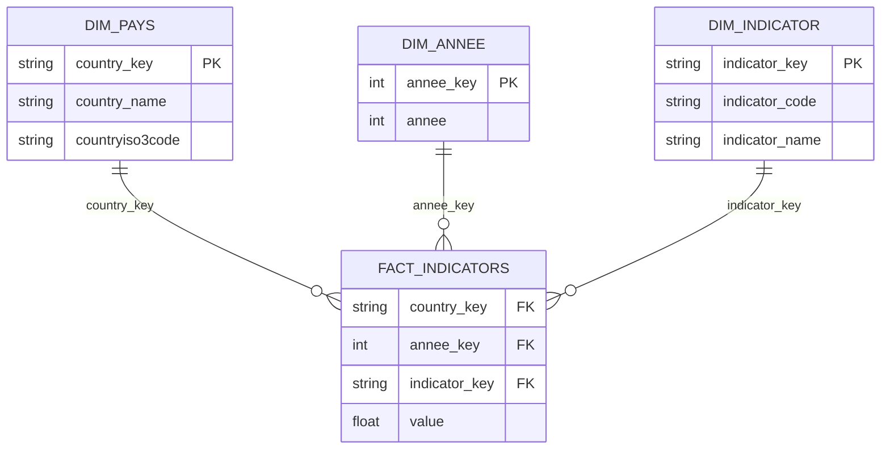

# Schéma de la base de données

## Présentation

Les données de la Banque mondiale sont modélisées avec dbt selon un schéma en étoile.

La table de faits `fact_indicators` contient les observations des indicateurs. Elle est reliée à trois dimensions : les pays, les années et les indicateurs.

## Schéma dimensionnel

## Relations

- `dim_pays` → `fact_indicators` : relation **1 à N** via `country_key`.
- `dim_annee` → `fact_indicators` : relation **1 à N** via `annee_key`.
- `dim_indicator` → `fact_indicators` : relation **1 à N** via `indicator_key`.

Une ligne de `fact_indicators` représente une observation unique pour une combinaison pays, année et indicateur.

## Tables analytiques

En complément du modèle dimensionnel, dbt construit deux tables destinées à l'analyse et au Machine Learning :

- `mart_country_indicators` : regroupe les principaux indicateurs sous forme de colonnes, avec une ligne par pays et par année ;
- `world_bank_features` : sélectionne les variables utilisées par le modèle de Machine Learning pour estimer l'espérance de vie.